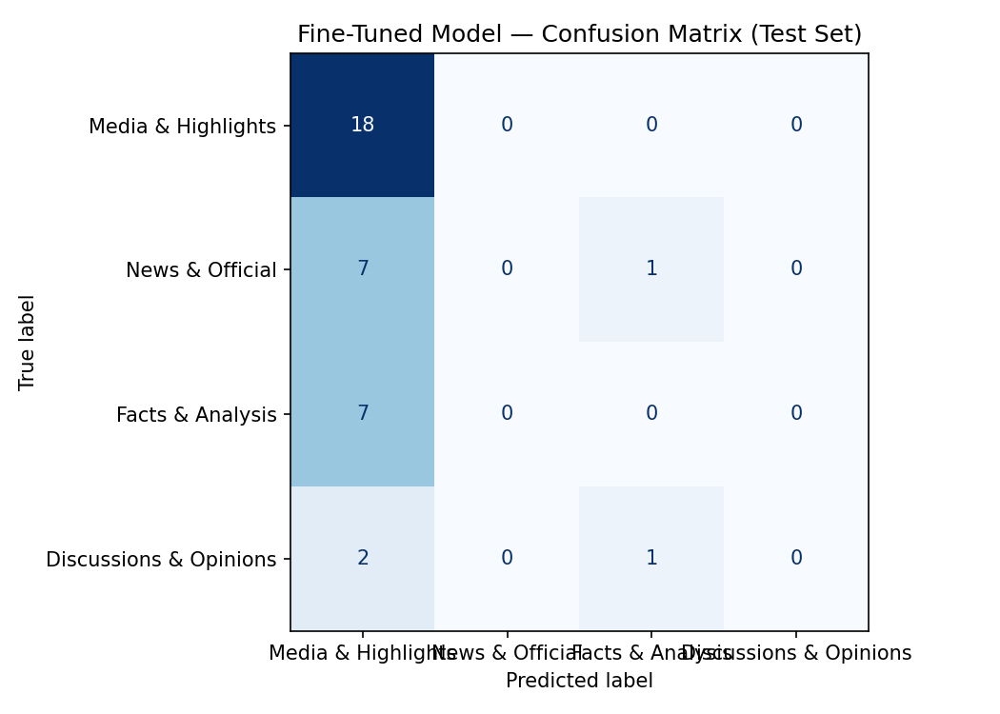

# TakeMeter - Project 3

---

## Demo Video

Link: 

---

## Community Choice & Reasoning

I chose baseball subreddits because this community contained some posts based on baseball game live highlights and some breaking news on Major League Baseball. This was a good fit for a classification task because it included hard data and subjective freedom. The discourse was varied enough to be interesting by highly technical, statistic-driven "sabermetric" analysis to immediate, emotional reactions during live game threads.

---

## Label Taxonomy

| Labels | Definition of Label | Example Post #1 | Example Post #2 |
|--------|-------------------------|------------------------------|------------------------------|
| Media & Highlights | Direct video clips of gameplay or in-game events. | Padres extend their lead to five with a Jackson Merrill towering 2-run shot in the 9th | The Rays take the lead and drop a 4-run 5th inning on Shohei Ohtani |
| News & Official | Direct links to reports, signings, transactions, or injury updates from recognized media or MLB sources. | [MLBTR] Braves To Select Carlos Carrasco, Jair Camargo | [Stebbins] Out in Milwaukee, the Guardians recalled Kahlil Watson from Triple-A Columbus while placing Chase DeLauter on the 10-day injured list |
| Facts & Analysis | Structured arguments supported by specific, verifiable statistical evidence (e.g., WAR, ERA+, historical trends), including fun facts and player's data of today's game without video clips. | Brett Kerry of the Angels just recorded a 5 pitch scoreless inning whilst also committing two errors | On this date in 1960, Ted Williams became the 4th member of the 500 HR club — here's what the leaderboard looked like on 6/17/1960 |
| Discussions & Opinions | Subjective discussions, questions, hypotheses, opinions, or "hot takes". | Has anyone seen an mlb sculpture that is a good likeness of its subject? | Do player's contracts pause if we have a full season lockout next year? |

---

## Data Collection

- **Data Collection Source:** r/baseball
- **Labeling Process:** I classified the total of 240 posts from baseball subreddits in 4 labels based on the label definitions from the "Label Taxonomy" section above. I also added notes on some posts for any difficult cases that are hard to classify. I also used ChatGPT to pre-label the first 50 posts with difficult cases explained, and I reviewed and corrected them by using two columns, "label" for my verified label and "label_by_model" for pre-labeled ones.
- **Label Distribution:** I had 120 posts on "Media & Highlights", 50 post on "News & Official", 50 posts on "Facts & Analysis", and 20 posts on "Discussions & Opinions". There were high frequency of "Media & Highlights" (50%) because many of the posts included video clips of in-game events. "Discussions & Opinions" were the lowest frequency (8.3%) because there were only high-effort subjective threads included in the baseball subreddits. After collecting 200 posts, I saw "News & Official" was underrepresented, so I added 40 more posts, including some posts for "Media & Highlights" to match the expected number of posts that I specified in Data Collection Plan section of planning.md, and some posts for "Discussions & Opinions" to avoid underrepresentation.
- **3 Difficult-to-label Examples:**

| Example Post | Two labels that sit at the boundary | Notes |
|-----------------------------|----------------------|-----------------------------------|
| [CloseCallSports] Explains the "Contreras Rule" in relation to José Caballero's pitch clock "antics" and warning given by ump in Sunday's game against the Blue Jays | "Media & Highlights" vs. "Facts & Analysis" | If the video is the focus, use "Media & Highlights". If the text is the focus, use "Facts & Analysis". |
| The Red Sox are the 2nd time in MLB history since 1898 to leave 13+ runners on base and score 1 or 0 runs in back-to-back games, joining the 1919 Washington Nationals. | "News & Official" vs. "Facts & Analysis" | If it is a simple statement of an event, use "News & Official". If it interprets the event, use "Facts & Analysis". |
| [TJStats] My Top 100 MLB Prospects | "Facts & Analysis" vs. "Discussions & Opinions" | If a specific stat is used to support a logical claim, use "Facts & Analysis". If there is an image that includes statistical information, use "Facts & Analysis". If no stat or evidence is included, use "Discussions & Opinions". |

---

## Fine Tuning Approach

- **Base Model:** distilbert-base-uncased
- **Training Setup:** The dataset was split into 70%/15%/15% and tokenized all splits. The training was performed on a T4 GPU for the last 15% of the dataset only (36 posts total) using the Trainer API, with accuracy as the primary metric to evaluate it, ensuring the model did not regress during training due to overfitting.
- **Hyperparameter Decisions:** I changed 4 things in hyperparamters. I changed num_train_epochs from 3 to 5, decreased the learning_rate to 5e-5, and increased the weight_decay to 0.10 and warmup_steps to 100. For changing the num_train_epochs, it allowed the model more passes to capture any lingustic patterns to improve the accuracy. For changing the learning_rate, it helped the model to converge more efficiently and identified more distinct class boundaries. For changing the weight_decay, it prevented the model from over-relying on a few specific keywords when classifying the posts. For changing the warmup_steps, it allowed the model to spend more time to adapt its internal representations to the baseball-specific vocabulary for more stable training.

---

## Baseline Description

The prompt I used was to say to the model that you are classifying the posts from baseball subreddits using the four labels I defined from the Labels section of planning.md. I redefined the labels by adding questions and hypotheses for "Discussions & Opinions" label, and saying no video clips for "Facts & Analysis" label to improve the overall accuracy of the baseline model. For the examples, I used the example post #1 from "Media & Highlights" and "News & Official" each, and the example post #2 from "Facts & Analysis" and "Discussions & Opinions" each. The results were collected by passing the test subset of the dataset through the classify_with_groq() function, which utilized the llama-3.3-70b-versatile model. 

---

## Full Evaluation Report

**Model Per-Class Metrics:**

- Model 1: llama-3.3-70b-versatile (Overall Accuracy: 0.861)

| Label | Precision | Recall | F1-Score | Support |
|-------|-----------|--------|----------|---------|
| Media & Highlights | 1.00 | 0.94 | 0.97 | 18 |
| News & Official | 0.64 | 0.88 | 0.74 | 8 |
| Facts & Analysis | 1.00 | 0.86 | 0.92 | 7 |
| Discussions & Opinions | 0.50 | 0.33 | 0.40 | 3 |

- Model 2: distilbert-base-uncased (Overall Accuracy: 0.889)

| Label | Precision | Recall | F1-Score | Support |
|-------|-----------|--------|----------|---------|
| Media & Highlights | 0.95 | 1.00 | 0.97 | 18 |
| News & Official | 0.70 | 0.88 | 0.78 | 8 |
| Facts & Analysis | 1.00 | 0.86 | 0.92 | 7 |
| Discussions & Opinions | 1.00 | 0.33 | 0.50 | 3 |

**Confusion Matrix:**

**Wrong Predictions & Analysis:**

| Post | Predicted Label | Confidence Score | Correct Label | Analysis |
|------|---------------------|---------|---------------------|-----------------------|
| [Kowatsch] Julio Rodriguez exits the game before the top of the seventh. Victor Robles moves to center field and Rob Refsnyder in at right. | Media & Highlights | 0.98 | News & Official | Gameplay-action verbs overpowered every other cue. |
| It appears the 2026 MLB All-Star Game hats have leaked thru an ad on TikTok | News & Official | 0.88 | Discussions & Opinions | News-topic vocabulary outweighed the speculation framing. |
| [Matheson] Anthony Santander is scheduled to start hitting "either this weekend or next", John Schneider said. So, sometime soon. "There's a shot he could definitely be a factor." Long road from here,... | News & Official | 0.90 | Discussions & Opinions | The bracketed byline mostly showed as "News & Official" since bylines appear accross News. |
| [CloseCallSports] Explains the "Contreras Rule" in relation to José Caballero's pitch clock "antics" and warning given by ump in Sunday's game against the Blue Jays | News & Official | 0.89 | Facts & Analysis | The bracketed byline mostly showed as "News & Official" since bylines appear accross News. |

**Sample Classifications:**
| Post | Predicted Label | Confidence Score |
|------|---------------------|---------------------|
| [Highlight] Nathan Lukes hits a solo homer to make it 3-0 for the Jays | Media & Highlights | 0.98 |
| Kyle Stowers now has 4 games as a Marlin with 10+ total bases, tied with Giancarlo Stanton for the most in franchise history | Facts & Analysis | 0.90 |
| It appears the 2026 MLB All-Star Game hats have leaked thru an ad on TikTok | News & Official | 0.88 |

*One Correct Prediction & Explanation why it is reasonable:*
The model correctly predicted the second example post from this sample classfications table with a 90% confidence. This is a reasonable prediction because this post identified key statistical indicators ('10+ total bases', 'franchise history') and comparing these stats to the players who were in the same team in the past. This showed that the model understood that it showed past historical data along with statistics of the current player.

---

## Model Reflection

The model learned about the authorship-based distinctions, which focused the 'voice' of the data. It overfitted to organize brackets and bylines as "News & Official" using contents from professional media. My intention was the original label taxonomy from planning.md that rely on content-based distinctions. For "News & Official" label, the definition was the updates from official baseball news. The model missed the distinction between 'inquiry' and 'report' as capturing the subjective discussions and question-based posts as "News & Official". For the future, I have to align the model with my intension by giving more examples on hard edge cases or more examples on "Discussions & Opinions" label.

---

## Spec Reflection

**One way the spec helped you during implementation:**
The spec helped me during implementation by referencing the label taxonomy and hard edge cases to collect the data and running the baseline and fine-tuning model to see the metrics. Pre-labeling also helped me to write some notes on edge cases for some posts.

**One way your implementation diverged from the spec, and why:**
My implementation was diverged from the spec by misclassification on "Discussions & Opinions" label mostly on fine-tuning model because I got a 0.00 for the f1-score result first, which shows that the model did not understand the boundaries between this label and other 3 labels. I changed some of the hyperparamters that I mentioned on the Fine-Tuning Approach section above later, but I needed to redefine this label and example post to let the model learn all of the boundaries, which also improved the f1-score for the fine-tuning model.

---

## AI Usage

**Instance 1**

- *What I gave the AI:* I gave ChatGPT my first 50 of 240 posts to pre-label them using my labels, label definitions, and hard edge cases, and asked to generate 5-10 posts that sit at the boundary between two labels.
- *What it produced:* ChatGPT classified 50 posts using my label names and mentioned some posts for difficult cases. It also generated 10 posts, and each post has two labels that can sit at the boundary, expected label, and explanation of why it is difficult to classify.
- *What I changed or overrode:* I labeled all of the posts, including the 50 pre-labeled posts. I also redefined the "Discussions & Opinions" label for adding questions and hypotheses.

**Instance 2**

- *What I gave the AI:* I gave Claude the posts that are predicted wrong by fine-tuning model and asked for the patterns that led to misclassifications.
- *What it produced:* It produced the patterns of misclassifications and any actionable fixes to produce good data.
- *What I changed or overrode:* I changed the hyperparameters of the fine-tuning model. I also redefined the "Facts & Analysis" label for adding in-game events without video clips, and changed the examples for "Discussions & Opinions" label.
